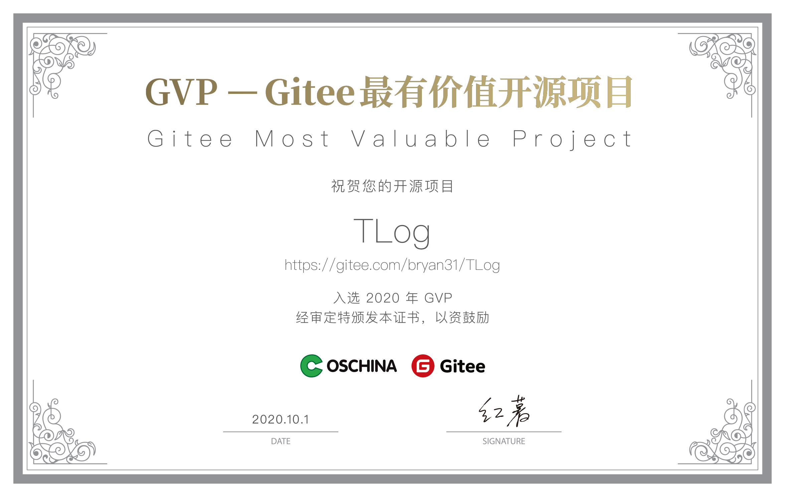

<h3>您的star是我继续前进的动力，如果喜欢请右上角帮忙点个star</h3>

## Gitee的star趋势图

## 贡献者

## 概述
TLog是一个轻量级的分布式日志标记追踪神器，10分钟即可接入，自动对日志打标签完成微服务的链路追踪。支持log4j，log4j2，logback三大日志框架，支持dubbo，dubbox，springcloud三大RPC框架

## 项目主页请点击：[项目主页](http://yomahub.com/tlog/)

## 示例工程请点击：[示例工程](https://gitee.com/bryan31/tlog-example)

## 特性
* 通过对日志打标签完成轻量级微服务日志追踪
* 提供三种接入方式：javaagent完全无侵入接入，字节码一行代码接入，基于配置文件的接入
* 对业务代码无侵入式设计，使用简单，10分钟即可接入
* 支持常见的log4j，log4j2，logback三大日志框架，并提供自动检测，完成适配
* 支持dubbo，dubbox，springcloud三大RPC框架
* 支持Spring Cloud Gateway和Soul网关
* 适配HttpClient和Okhttp的http调用标签传递
* 支持三种任务框架，JDK的TimerTask，Quartz，XXL-JOB
* 支持日志标签的自定义模板的配置，提供多个系统级埋点标签的选择
* 支持异步线程的追踪，包括线程池，多级异步线程等场景
* 几乎无性能损耗，快速稳定，经过压测，损耗在0.01%

由于社区群超过200人，需要邀请入群。关注公众号后点击`个人微信`加我，我可以拉你入群

### 精品项目推荐

|项目名称 | 项目地址 | 项目介绍 |
|---|---|---|
| LiteFlow      | [https://gitee.com/dromara/liteFlow](https://gitee.com/dromara/liteFlow) | 轻量，快速，稳定，可编排的组件式流程引擎|
| TLog GVP 项目 | [https://gitee.com/dromara/TLog](https://gitee.com/dromara/TLog) | 一个轻量级的分布式日志标记追踪神器，10分钟即可接入，自动对日志打标签完成微服务的链路追踪 |
| Sa-Token | [https://gitee.com/dromara/sa-token](https://gitee.com/dromara/sa-token) | 这可能是史上功能最全的 Java 权限认证框架！ |
| SpringBoot_v2      | [https://gitee.com/bdj/SpringBoot_v2](https://gitee.com/bdj/SpringBoot_v2) | 基于springboot的一款纯净脚手架|

开源不易，支持就请赞助TLog

