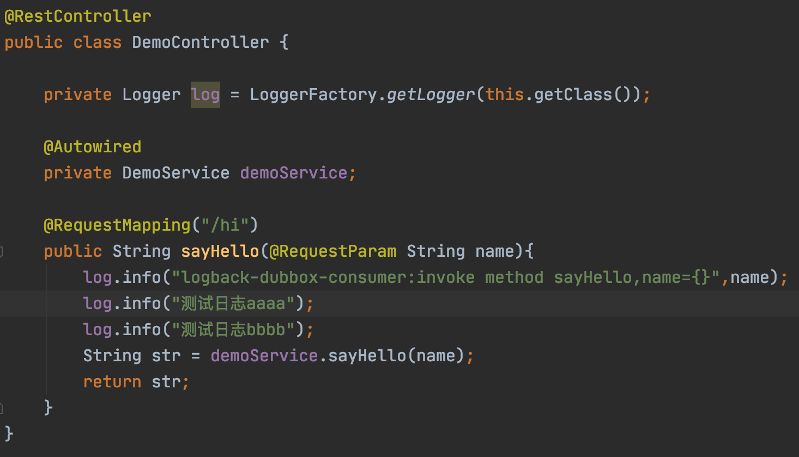
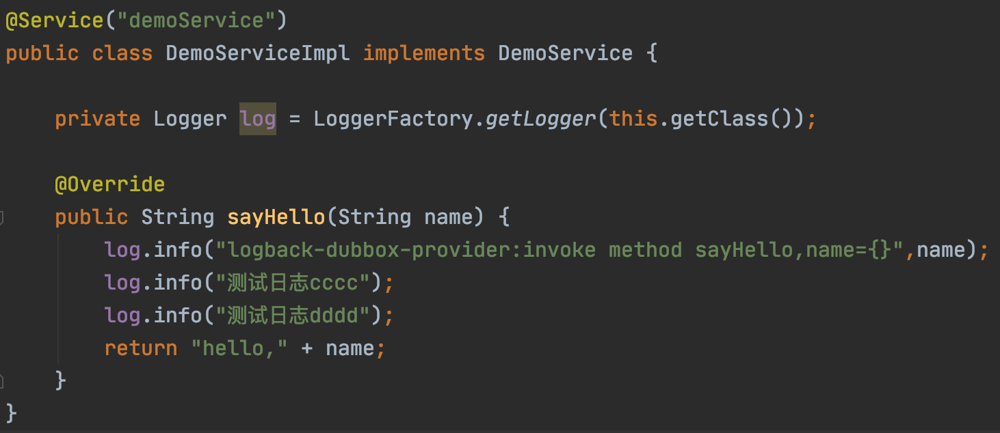
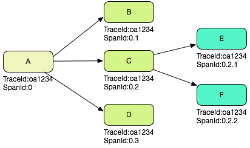

# 一.TLog能解决什么痛点

随着微服务盛行，很多公司都把系统按照业务边界拆成了很多微服务，在排错查日志的时候。因为业务链路贯穿着很多微服务节点，导致定位某个请求的日志以及上下游业务的日志会变得有些困难。

这时候很多童鞋会开始考虑上SkyWalking，Pinpoint等分布式追踪系统来解决，基于OpenTracing规范，而且通常都是无侵入性的，并且有相对友好的管理界面来进行链路Span的查询。

但是搭建分布式追踪系统，熟悉以及推广到全公司的系统需要一定的时间周期，而且当中涉及到链路span节点的存储成本问题，全量采集还是部分采集？如果全量采集，就以SkyWalking的存储来举例，ES集群搭建至少需要5个节点。这就需要增加服务器成本。况且如果微服务节点多的话，一天下来产生几十G上百G的数据其实非常正常。如果想保存时间长点的话，也需要增加服务器磁盘的成本。

当然分布式追踪系统是一个最终的解决方案，如果您的公司已经上了分布式追踪系统，那TLog并不适用。

**TLog提供了一种最简单的方式来解决日志追踪问题，它不收集日志，也不需要另外的存储空间，它只是自动的对你的日志进行打标签，自动生成TraceId贯穿你微服务的一整条链路。并且提供上下游节点信息。适合中小型企业以及想快速解决日志追踪问题的公司项目使用。**

**为此我为了TLog适配了三大日志框架，支持自动检测适配。支持dubbo，dubbox，spring cloud三大RPC框架，更重要的是，你的项目接入TLog，可能连十分钟就不需要 ：）**


# 二.项目特性

<font color="#21433d">**目前TLog的支持的特性如下：**</font>

* <font color="#21433d">**通过对日志打标签完成轻量级微服务日志追踪**</font>
* <font color="#21433d">**对业务代码无侵入式设计，使用简单，10分钟即可接入**</font>
* <font color="#21433d">**支持常见的log4j，log4j2，logback三大日志框架，并提供自动检测，完成适配**</font>
* <font color="#21433d">**支持dubbo，dubbox，springcloud三大RPC框架**</font>
* <font color="#21433d">**支持日志标签的自定义模板的配置，提供多个系统级埋点标签的选择**</font>
* <font color="#21433d">**提供spanId来表示本次调用在整个调用链路树中的位置**</font>
* <font color="#21433d">**支持方法级别的标签自定义埋入**</font>
* <font color="#21433d">**天然支持异步线程的追踪**</font>
* <font color="#21433d">**几乎无性能损耗**</font>


让我们开始吧！


# 三.快速开始

TLog支持了springboot的自动装配，在springboot环境下，只需要以下两步就可以接入！
## 3.1 依赖

```xml
<dependency>
  <groupId>com.yomahub</groupId>
  <artifactId>tlog-all-spring-boot-starter</artifactId>
  <version>1.1.0</version>
</dependency>
```
**目前jar包已上传中央仓库，可以直接依赖到**


## 3.2 日志框架适配

只需要在你的启动类中加入一行代码，即可以自动进行探测你项目所使用的Log框架，并进行增强。

```java
@SpringBootApplication
public class Runner {

    static {AspectLogEnhance.enhance();}//进行日志增强，自动判断日志框架

    public static void main(String[] args) {
        SpringApplication.run(Runner.class, args);
    }
}
```

!> 因为这里是用javassist实现，需要在jvm加载对应日志框架的类之前，进行字节码增强。所以这里用static块。并且Springboot/Spring的启动类中不能加入log定义，否则会不生效。或者如果你是用tomcat/jboss/jetty等外置容器启动的，则参照`4.1 Log框架配置文件增强`


## 3.3 RPC框架的适配

在Springboot环境下，TLog会自动探测你用的RPC框架，自动进行适配。


## 3.4 最终效果

只需要以上这2步，就可以把springboot项目快速接入了

这里以dubbo+log4j为例，Consumer端代码



日志打印：

```
2020-09-16 18:12:56,748 [WARN] [TLOG]重新生成traceId[7161457983341056]  >> com.yomahub.tlog.web.TLogWebInterceptor:39
2020-09-16 18:12:56,763 [INFO] <0><7161457983341056> logback-dubbox-consumer:invoke method sayHello,name=jack  >> com.yomahub.tlog.example.dubbox.controller.DemoController:22
2020-09-16 18:12:56,763 [INFO] <0><7161457983341056> 测试日志aaaa  >> com.yomahub.tlog.example.dubbox.controller.DemoController:23
2020-09-16 18:12:56,763 [INFO] <0><7161457983341056> 测试日志bbbb  >> com.yomahub.tlog.example.dubbox.controller.DemoController:24
```


Provider代码：




日志打印：

```
2020-09-16 18:12:56,854 [INFO] <0.1><7161457983341056> logback-dubbox-provider:invoke method sayHello,name=jack  >> com.yomahub.tlog.example.dubbo.service.impl.DemoServiceImpl:15
2020-09-16 18:12:56,854 [INFO] <0.1><7161457983341056> 测试日志cccc  >> com.yomahub.tlog.example.dubbo.service.impl.DemoServiceImpl:16
2020-09-16 18:12:56,854 [INFO] <0.1><7161457983341056> 测试日志dddd  >> com.yomahub.tlog.example.dubbo.service.impl.DemoServiceImpl:17
```


可以看到，经过简单接入后，各个微服务之间每个请求有一个全局唯一的traceId贯穿其中，对所有的日志输出都能生效，这下定位某个请求的日志链就变得轻松了。


?> 其中traceId前面的0，0.1是spanId，关于spanId的说明请参阅`六.SpanId的生成规则`。


# 四.Log框架配置文件增强

如果你的自动化日志探测失效或者你用的是外置容器，你需要针对你项目中的日志框架配置进行修改，修改方法也很简单。

## 4.1 Log4J配置文件增强

只需要把`layout`的实现类换掉就可以了

每个公司的Log4J的模板大同小异，这里只给出xml的例子

```xml
<?xml version="1.0" encoding="UTF-8"?>
<!DOCTYPE log4j:configuration SYSTEM "log4j.dtd">
<log4j:configuration>
    <appender name="stdout" class="org.apache.log4j.ConsoleAppender">
        <!--替换成AspectLog4jPatternLayout-->
        <layout class="com.yomahub.tlog.core.enhance.log4j.AspectLog4jPatternLayout">
            <param name="ConversionPattern" value="%d{yyyy-MM-dd HH:mm:ss,SSS} [%p] %m  >> %c:%L%n"/>
        </layout>
    </appender>
    <appender name="fileout" class="org.apache.log4j.DailyRollingFileAppender">
        <param name="File" value="./logs/test.log"/>
        <!--替换成AspectLog4jPatternLayout-->
        <layout class="com.yomahub.tlog.core.enhance.log4j.AspectLog4jPatternLayout">
            <param name="ConversionPattern" value="%d{yyyy-MM-dd HH:mm:ss,SSS} [%p] %m  >> %c:%L%n"/>
        </layout>
    </appender>
    <root>
        <priority value="info" />
        <appender-ref ref="stdout"/>
        <appender-ref ref="fileout"/>
    </root>
</log4j:configuration>

```


## 4.2 Logback的配置文件增强

换掉`encoder`的实现类或者换掉`layout`的实现类就可以了

以下给出xml示例：

```xml
<?xml version="1.0" encoding="UTF-8"?>
<configuration debug="false">
    <property name="APP_NAME" value="logtest"/>
    <property name="LOG_HOME" value="./logs" />
    <appender name="STDOUT" class="ch.qos.logback.core.ConsoleAppender">
        <!--替换成AspectLogbackEncoder-->
		<encoder class="com.yomahub.tlog.core.enhance.logback.AspectLogbackEncoder">
			  <pattern>%d{yyyy-MM-dd HH:mm:ss.SSS} [%thread] %-5level %logger{50} - %msg%n</pattern>
		</encoder>
    </appender>
    <appender name="FILE"  class="ch.qos.logback.core.rolling.RollingFileAppender">
        <File>${LOG_HOME}/${APP_NAME}.log</File>
        <rollingPolicy class="ch.qos.logback.core.rolling.SizeAndTimeBasedRollingPolicy">
            <FileNamePattern>${LOG_HOME}/${APP_NAME}.log.%d{yyyy-MM-dd}.%i.log</FileNamePattern>
            <MaxHistory>30</MaxHistory>
            <maxFileSize>1000MB</maxFileSize>
        </rollingPolicy>
        <!--替换成AspectLogbackEncoder-->
        <encoder class="com.yomahub.tlog.core.enhance.logback.AspectLogbackEncoder">
            <pattern>%d{yyyy-MM-dd HH:mm:ss.SSS} [%thread] %-5level %logger{50} - %msg%n</pattern>
        </encoder>
    </appender>

    <!-- 日志输出级别 -->
    <root level="INFO">
        <appender-ref ref="STDOUT" />
        <appender-ref ref="FILE" />
    </root>
</configuration>

```


## 4.3 Log4J2的配置文件增强

log4J2由于是通过插件形式实现的，log4J2有自动扫描插件的功能。所以无需对配置文件做任何更改就能生效。


# 五.日志标签模板自定义

TLog默认只打出traceId，以<$traceId>这种模板打出，当然你能自定义其模板。还能加入其它的标签头

你只需要在springboot的application.properties里如下定义：

```properties
tlog.pattern=[$preApp][$preIp][$spanId][$traceId]
```

`$preApp` ：上游微服务节点名称

`$preIp`：上游微服务的IP地址

`$spanId`：链路spanId，具体规则可以参照`六.SpanId生成规则`

`$traceId`：全局唯一跟踪ID


这样日志的打印就能按照你定义模板进行打印


# 六.SpanId的生成规则

TLog默认的标签打印模板是`<\$spanId><\$traceId>`

TLog 中的 SpanId 代表本次调用在整个调用链路树中的位置，假设一个 Web 系统 A 接收了一次用户请求，那么在这个系统的日志中，记录下的 SpanId 是 0，代表是整个调用的根节点，如果 A 系统处理这次请求，需要通过 RPC 依次调用 B，C，D 三个系统，那么在 A 系统的客户端日志中，SpanId 分别是 0.1，0.2 和 0.3，在 B，C，D 三个系统的服务端日志中，SpanId 也分别是 0.1，0.2 和 0.3；如果 C 系统在处理请求的时候又调用了 E，F 两个系统，那么 C 系统中对应的客户端日志是 0.2.1 和 0.2.2，E，F 两个系统对应的服务端日志也是 0.2.1 和 0.2.2。根据上面的描述，我们可以知道，如果把一次调用中所有的 SpanId 收集起来，可以组成一棵完整的链路树。

我们假设一次分布式调用中产生的 TraceId 是 `0a1234`（实际不会这么短），那么根据上文 SpanId 的产生过程，有下图：




# 七.业务标签

TLog有`traceId`,`spanId`等框架级标签，但是也支持自定义业务标签，支持方法级别。你可以在某一个方法的日志里，统一加入业务的指标签，用于更加细致的定位

## 7.1简单例子

在你的方法上加上`@TLogAspect`标注。简单的例子如下：

```java
@TLogAspect({"id"})
public void demo1(String id,String name){
  log.info("这是第一条日志");
  log.info("这是第二条日志");
  log.info("这是第三条日志");
  new Thread(() -> log.info("这是异步日志")).start();
}
```

假设id的值为'NO1234'，日志打出来的样子如下，其中前面为框架spanId+traceId

```
2020-02-08 20:22:33.945 [main] INFO  Demo - <0.2><7205781616706048>[NO1234] 这是第一条日志
2020-02-08 20:22:33.945 [main] INFO  Demo - <0.2><7205781616706048>[NO1234] 这是第二条日志
2020-02-08 20:22:33.945 [main] INFO  Demo - <0.2><7205781616706048>[NO1234] 这是第三条日志
2020-02-08 20:22:33.948 [Thread-3] INFO  Demo - <0.2><7205781616706048>[NO1234] 这是异步日志
```


## 7.2 多个数值

`@TLogAspect`标注支持多个参数:

```java
@TLogAspect({"id","name"})
public void demo1(String id,String name){
  log.info("这是第一条日志");
  log.info("这是第二条日志");
  log.info("这是第三条日志");
  new Thread(() -> log.info("这是异步日志")).start();
}
```

假设传入id的值为'NO1234'，name为'jenny'，日志打出来的样子如下，其中前面为框架spanId+traceId：

```
2020-02-08 22:09:40.101 [main] INFO  Demo - <0.2><7205781616706048>[NO1234-jenny] 这是第一条日志
2020-02-08 22:09:40.101 [main] INFO  Demo - <0.2><7205781616706048>[NO1234-jenny] 这是第二条日志
2020-02-08 22:09:40.102 [main] INFO  Demo - <0.2><7205781616706048>[NO1234-jenny] 这是第三条日志
2020-02-08 22:09:40.103 [Thread-3] INFO  Demo - <0.2><7205781616706048>[NO1234-jenny] 这是异步日志
```


## 7.3 多数值连接符

`@TLogAspect`支持自定pattern和多个参数的连接符：

```java
@TLogAspect(value = {"id","name"},pattern = "<-{}->",joint = "_")
public void demo(String id,String name){
  log.info("加了patter和joint的示例");
}
```

日志打出来的样子如下，其中前面为框架spanId+traceId：

```
2020-02-08 22:09:40.103 [main] INFO  Demo - <0.2><7205781616706048><-NO1234_jenny-> 加了patter和joint的示例
```


## 7.4 点操作符

`@TLogAspect`支持点操作符，适用于对象的取值，支持类型为业务对象和Map

```java
@TLogAspect({"person.id","person.age","person.company.department.dptId"})
public void demo(Person person){
  log.info("多参数加多层级示例");
}
```

日志打出来的样子如下，其中前面为框架spanId+traceId：

```
2020-02-08 22:09:40.110 [main] INFO  Demo - <0.2><7205781616706048>[31-25-80013] 多参数加多层级示例
```


## 7.5 自定义Convert

`@TLogAspect`支持自定义Convert，适用于更复杂的业务场景

```java
@TLogAspect(convert = CustomAspectLogConvert.class)
public void demo(Person person){
  log.info("自定义Convert示例");
}
```

```java
public class CustomAspectLogConvert implements AspectLogConvert {
    @Override
    public String convert(Object[] args) {
        Person person = (Person)args[0];
        return "PERSON(" + person.getId() + ")";
    }
}
```

日志打印出来的样子如下，其中前面为框架spanId+traceId：

```
2020-02-20 17:05:12.414 [main] INFO  Demo - <0.2><7205781616706048>[PERSON(31] 自定义Convert示例
```


# 八.异步线程支持

## 8.1 一般异步线程

对于一般异步线程（执行好之后线程会被销毁），不需要你做任何事，TLog天然支持在异步线程中打印标签。


## 8.2 线程池

但是对于使用了线程池的场景，由于线程池中的线程不会被销毁，会被复用。需要你用`TLogInheritableTask`替换`Runnable`，否则标签数据会重复：

```java
executorService.submit(new TLogInheritableTask() {
    @Override
    public void runTask() {
      log.info("我是异步线程日志");
    }
});
```

这样标签数据就能正确打印了。


# 九.非Springboot项目接入

需要引入maven依赖
```xml
<dependency>
  <groupId>com.yomahub</groupId>
  <artifactId>tlog-all</artifactId>
  <version>1.1.0</version>
</dependency>
```
**目前jar包已上传中央仓库，可以直接依赖到**

## 9.1 dubbo & dubbox

如果你的RPC是dubbo或者dubbox，需要在spring xml里如下配置

```xml
<bean class="com.yomahub.tlog.web.TLogWebConfig"/>
<bean class="com.yomahub.tlog.core.aop.AspectLogAop"/>
```


## 9.2 Spring Cloud

如果你的RPC是spring cloud，需要在spring xml里如下配置

```xml
<bean class="com.yomahub.tlog.feign.filter.TLogFeignFilter"/>
<bean class="com.yomahub.tlog.core.aop.AspectLogAop"/>
```


## 9.3 自定义模板

如果你要自定义模板，需要在spring xml如下配置

```xml
<bean class="com.yomahub.tlog.context.TLogLabelGenerator">
    <property name="labelPattern" value="[$preApp][$preIp][$traceId]"/>
</bean>
```


# 十.联系作者

关注公众号回复`tlog`即可加入讨论群


